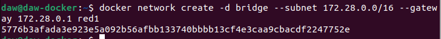
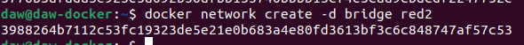
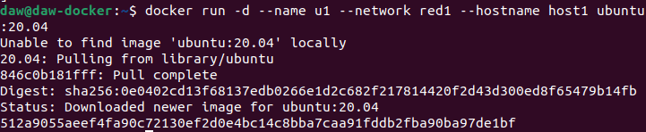
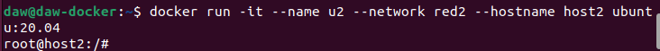
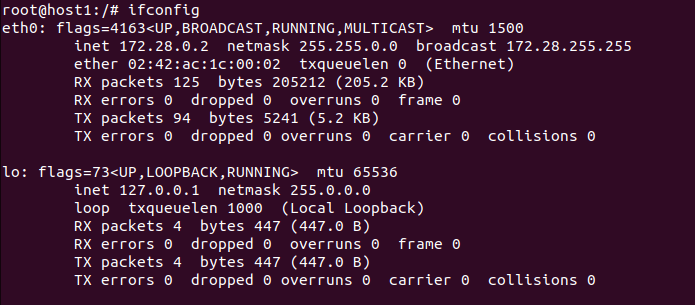
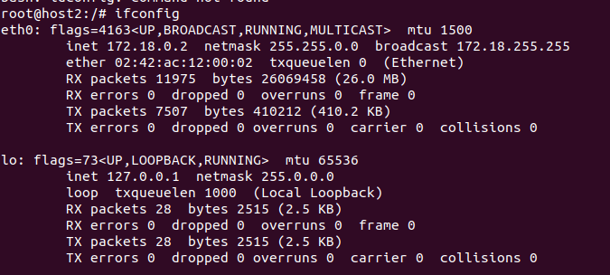

# DOCKER 4
### 1. Vamos a crear dos redes de ese tipo (BRIDGE) con los siguientes datos :
Red1
Nombre: red1
Dirección de red: 172.28.0.0
Máscara de red: 255.255.0.0
Gateway: 172.28.0.1
Red2
Nombre: red2
Es resto de los datos será proporcionados automáticamente por Docker

- Creamos red 1

- Creamos red2

### 2. Poner en ejecución un contenedor de la imagen ubuntu:20.04 que tenga como hostname host1 , como IP 172.28.0.10 y que esté conectado a la red1. Lo llamaremos u1 .

### 3. Entrar en ese contenedor e instalar la aplicación ping ( apt update && apt install inetutils-ping ).

### 4. Poner en ejecución un contenedor de la imagen ubuntu:20.04 que tenga como hostname host2 y que esté conectado a la red2. En este caso será docker el que le de una IP correspondiente a esa red. Lo llamaremos u2 .
 
 
- Configuracion de red de host 1

 - Configuracion de red de host 2 
 
 - No pueden hacerse ping 
 