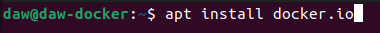
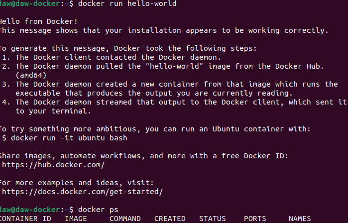
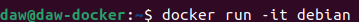
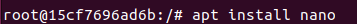
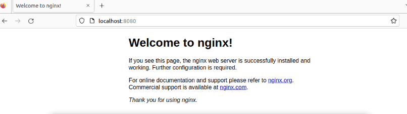
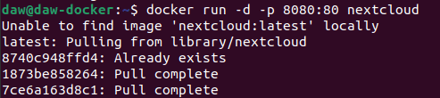
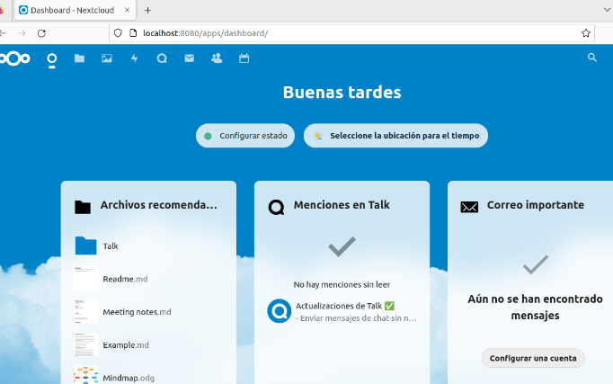

# Docker 1
## . Instala docker en una máquina y configúralo para que se pueda usar con un usuario sinprivilegios.

## 2. Ejecuta un contenedor a partir de la imagen hello-word. Comprueba que nos devuelve la salida adecuada. Comprueba que no se está ejecutando. Lista los contenedores que están parado. Borra el contenedor.

## 3. Crea un contenedor interactivo desde una imagen debian. Instala un paquete (por ejemplonano). Sal de la terminal, ¿sigue el contenedor corriendo? ¿Por qué?. Vuelve a iniciar elcontenedor y accede de nuevo a él de forma interactiva. ¿Sigue instalado el nano?. Sal delcontenedor, y bórralo. Crea un nuevo contenedor interactivo desde la misma imagen. ¿Tieneel nano instalado?

- Al abrir y cerrar el contenedor, este sigue teniendo nano, mas al crear uno nuevo no lo tiene.

## 4. Crea un contenedor demonio con un servidor nginx, usando la imagen oficial de nginx. Alcrear el contenedor, ¿has tenido que indicar algún comando para que lo ejecute? Accede alnavegador web y comprueba que el servidor esta funcionando. Muestra los logs delcontenedor.

- Le indiqué las instrucciones para arrancar en el comando posterior

## 5. Crea un contenedor con la aplicación Nextcloud, mirando la documentación en docker Hub,para personalizar el nombre de la base de datos sqlite que va a utilizar.

