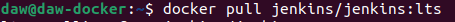

# Docker 2
## Descarga las siguientes imágenes: ubuntu:18.04, httpd, tomcat:9.0.39-jdk11,jenkins/jenkins:lts, php:7.4-apache.

## Muestras las imágenes que tienes descargadas.

## Crea un contenedor demonio con la imagen php:7.4-apache.

## Comprueba el tamaño del contenedor en el disco duro.

## Con la instrucción docker cp podemos copiar ficheros a o desde un contenedor. Puedes encontrar información es esta página. Crea un fichero en tu ordenador, con el siguientecontenido:Copia un fichero info.php al directorio /var/www/html del contenedor con docker cp.

## Accede al fichero info.php desde un navegador web.

